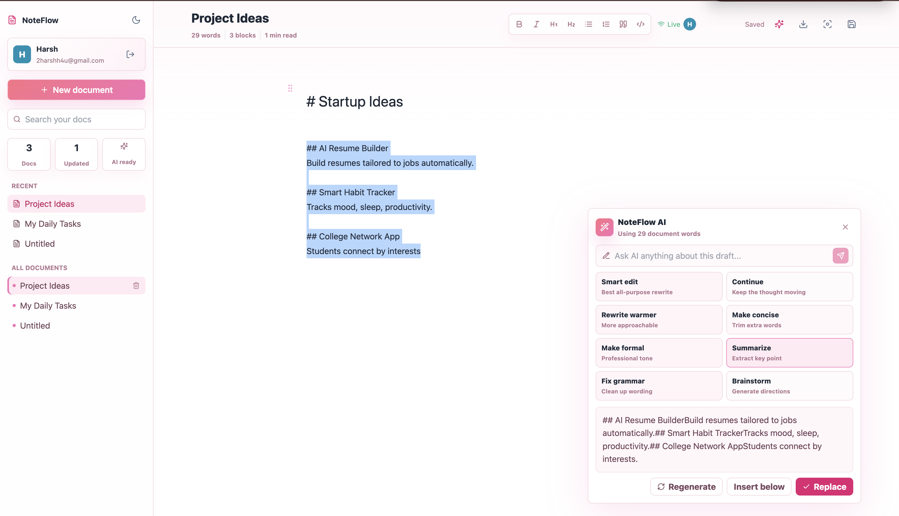
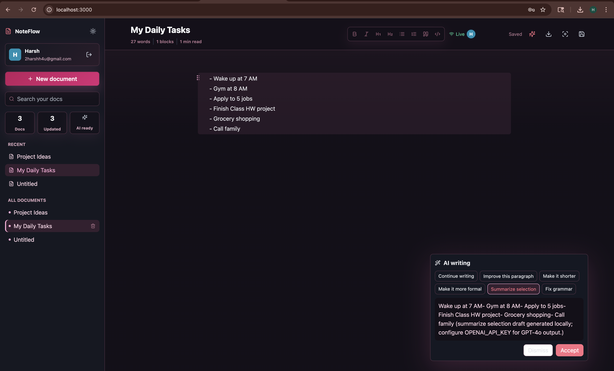
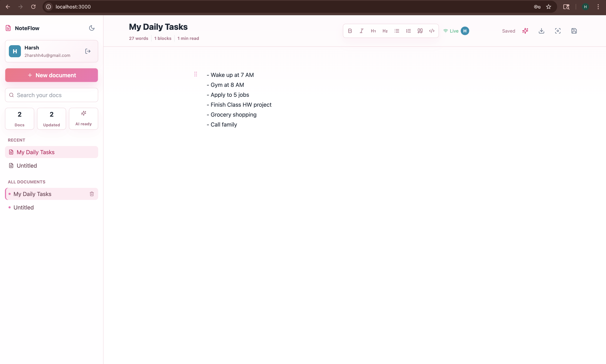

# NoteFlow

NoteFlow is a Notion-inspired, AI-powered writing assistant with a block editor, inline AI suggestions, semantic document search, and real-time collaboration.

## Stack

- Frontend: React 18, TypeScript, TipTap, TailwindCSS, Axios, WebSocket
- Backend: FastAPI, SQLAlchemy, PostgreSQL, pgvector, OpenAI, JWT auth
- Infra: Docker Compose, Nginx reverse proxy

## Quick Start

1. Copy `.env.example` to `.env` and add an OpenAI API key.
2. Run:

```bash
docker compose up --build
```

3. Open:

- Frontend: http://localhost:3000
- Backend API: http://localhost:8000/docs
- Reverse proxy: http://localhost

## Production Deployment

The repo includes a production Docker Compose setup for a single VPS or Docker host. It builds the React app into static files, serves it with Nginx, runs FastAPI without reload, and keeps PostgreSQL + pgvector in a persistent Docker volume.

For the simplest hosted deployment, use Render. See [DEPLOYMENT.md](DEPLOYMENT.md) for step-by-step Render instructions.

1. Copy the production environment file:

```bash
cp .env.production.example .env.production
```

2. Edit `.env.production`:

- Set `POSTGRES_PASSWORD` to a long random password.
- Set `JWT_SECRET` to a long random secret.
- Set `FRONTEND_ORIGIN` to the final site URL, such as `https://noteflow.example.com`.
- Add `OPENAI_API_KEY` for real AI and semantic embeddings.

3. Build and start production services:

```bash
docker compose --env-file .env.production -f docker-compose.prod.yml up -d --build
```

4. Open your server URL. The production Nginx proxy serves:

- Frontend: `/`
- Backend API: `/api`
- WebSockets: `/ws`

5. To view logs:

```bash
docker compose --env-file .env.production -f docker-compose.prod.yml logs -f
```

For a custom domain, point DNS at the server and put a TLS proxy such as Caddy, Traefik, or a cloud load balancer in front of the Compose stack. Set `FRONTEND_ORIGIN` to the HTTPS domain.

## Features

- TipTap block editor with paragraph, headings, lists, code blocks, quotes, and dividers
- Slash command menu
- Inline AI command popup with streaming suggestions and Tab/Escape controls
- Document sidebar with recent docs and creation flow
- Semantic search across document chunks with highlighted snippets
- WebSocket collaboration room per document with user cursors and block sync
- JWT auth with user profile colors
- Auto-save and auto-indexing on document save

## Screenshots

### AI copilot in the light editor



This screenshot shows the upgraded baby-pink light UI, the block-based editor, document sidebar, live collaboration status, formatting toolbar, and the interactive NoteFlow AI panel. The AI panel supports context-aware actions such as Smart edit, Continue, Rewrite warmer, Make concise, Summarize, Fix grammar, Brainstorm, custom prompts, regeneration, inserting below, and replacing selected text.

### Dark mode AI writing assistant



This screenshot captures the earlier dark-mode editor experience with a floating AI writing popup. It highlights the document sidebar, daily-task document, live user presence, formatting toolbar, and the AI suggestion flow for selected writing.

### Clean light-mode editor workspace



This screenshot shows the clean light-mode writing workspace with the pink-accent sidebar, document statistics, recent/all document lists, document title metrics, formatting controls, live collaboration indicator, save state, and a focused block editor canvas.
